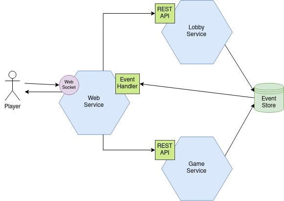

# Microservices Chess

In this project I built a backend composed by several microservices that work together to simulate a matchmaking service for chess games to which several clients can connect and create a **Game Proposal**. A different client can then accept the proposal and a **Game** between the two clients will be created.

Each of these entities are saved in the form of a **stream of events** in an [EventStore DB](https://www.eventstore.com/). This means that not only the last state of an entity is maintained, but the entire history of events that changed it. An entity can then be recovered by instantiating a new entity and applying to it the entire sequence of events of the stream.

Every microservice has been developed in TDD (Test Driven Development) in isolated environments using [Docker](https://www.docker.com/) and [Dev Containers](https://containers.dev/) and the building and testing of the project can be automated through [Maven](https://maven.apache.org/).

To try out the fully functional application, every microservice can be deployed in its own container using [Docker Compose](https://docs.docker.com/compose/). See [Build and Run](#build-and-run).

## Microservices



The **LobbyService** and **GameService** implement the command-side of the [CQRS pattern](https://learn.microsoft.com/en-us/azure/architecture/patterns/cqrs).<br>
The **WebService** acts as a simple gateway to which the clients connect.

### Lobby service

The Lobby service is responsible of handling the _creation_, _cancellation_ and _acceptance_ of **Game Proposals**.
Each of these events produce a change in the state of the Game Proposal and are thus saved in the EventStore.

The API of this service provides the following operations:

- createGameProposal()
- cancelGameProposal()
- acceptGameProposal()

The API is served using the [Jakarta EE](https://jakarta.ee/) specification and [Wildfly](https://www.wildfly.org/).

### Game service

The Game service is responsible of handling the game between two players. The **Game** is also an entity which state is modified by events generated by the players which are thus saved in the EventStore.

The API of this service provides the following operations:

- createGame()
- playMove()

The API is served using the [Jakarta EE](https://jakarta.ee/) specification and [Wildfly](https://www.wildfly.org/).

### Web service

The web service provides a WebSocket interface to which the clients connect and will in turn call the other services API.<br>
It also uses the subscription feature of EventStore to listen for events of interest to send back to clients.

The API of this service provides the following operations:

- sendCreateGameProposalRequest()
- sendAcceptGameProposalRequest()
- sendPlayMoveRequest()

WebSocket is implemented using [Spring Boot](https://spring.io/projects/spring-boot).

I also created a simple frontend to try out the application using [Vue.js](https://vuejs.org/) which is served by the Web service for simplicity.

## Build and Run

Clone the repo:

```bash
$ git clone https://github.com/marcodiri/micros-chess.git
$ cd micros-chess
```

### Testing

Unit tests:

```bash
$ mvn clean test -f "./micros-chess-parent/pom.xml"
# Or with Docker
$ docker run -it --rm -v "$(pwd)":/usr/src/mymaven -w /usr/src/mymaven maven:3.9.4-eclipse-temurin-17-alpine mvn clean test -f "./micros-chess-parent/pom.xml"
```

Integration tests (Docker required):

```bash
$ mvn clean verify -f "./micros-chess-parent/pom.xml"
```

### Run

Run the script (Docker required):

```bash
$ chmod +x ./build-and-run.sh
$ ./build-and-run.sh
```

The script will automatically pull [Node](https://hub.docker.com/_/node) and [Maven](https://hub.docker.com/_/maven) images to build the microservices and the [Wildfly](https://github.com/jboss-dockerfiles/wildfly) and [EventStoreDB](https://hub.docker.com/r/eventstore/eventstore) images to start the services.<br>
You can then open the application in your browser by visiting [http://localhost:8080](http://localhost:8080).<br>
The EventStore can be explored at [http://localhost:2113](http://localhost:2113).

## Demo

https://github.com/marcodiri/micros-chess/assets/29022021/216df5fd-1819-428c-8abd-84a0f8ab3592
